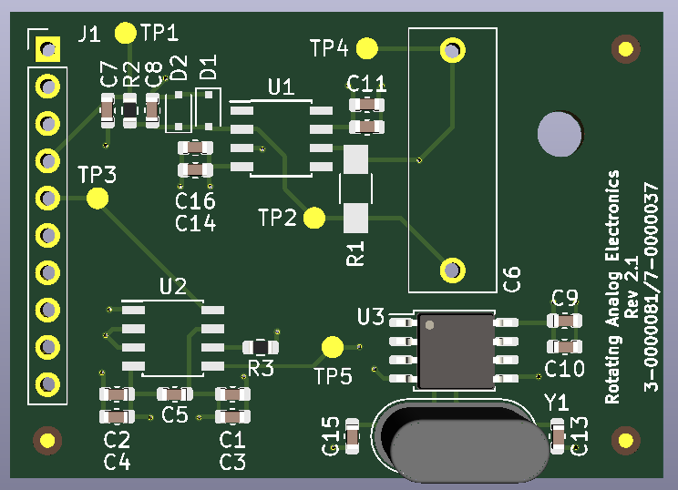
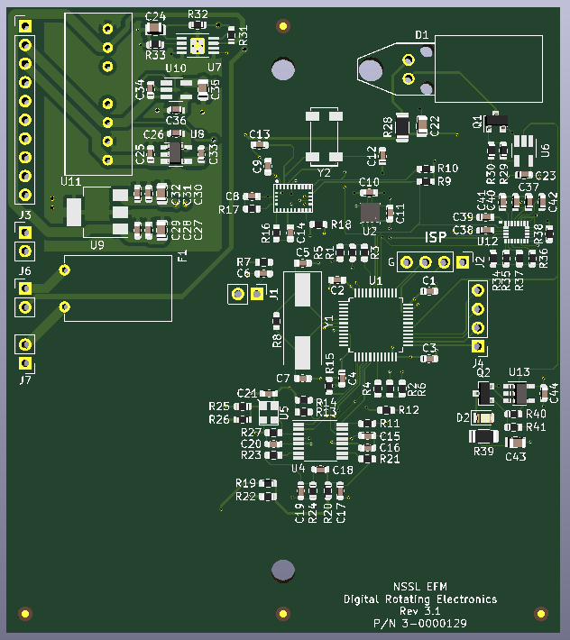
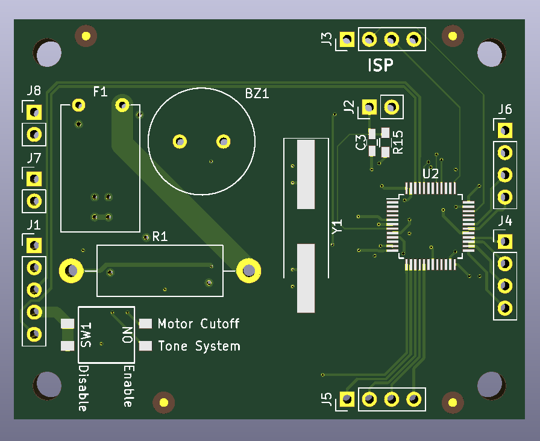

# Balloon Borne Electric Field Meter

This repository contains all files and relevant information for the electric field meter
(EFM) designed for NSSL. This instrument has been in existance for many years, but beginning
in approximatley 2019/2020 Leeman Geophysical was contracted to help design and implement the
next generation of the device. This README should be a living document keeping the most
current and relevant information on the assembly, operation, and programming of the
instrument.

Where there are other system components that are not directly part of the instrument (such as
the cutdown system), we will link to the relevant documentation.

## Mechanical Parts

A current version of the Fusion 360 project is [here](Mechanical/EFM%20v92.f3z), but be
careful as it is quite a bear with lots of older artifacts from previous revisions and
the assembly isn't completed as that just wasn't necessary to machine the parts.
Please update any changes made!

### Fiberglass Body and Spheres
These are provided by NSSL and we believed to be made by the OU Physics machine shop at some
time in the past. When more are needed we can evaluate the design and manufacturing options
at that time.

### Foams
The electronics for the EFM are protected from the environment (water, wind, and cold) by the
foam paddles that also serve to direct airflow to make the instrument rotate about the Earth
perpendicular axis. The foams are machined from 1" thick blue insulation foam such as
[item 14615](https://www.lowes.com/pd/Dow-Common-1-in-x-4-ft-x-8-ft-Actual-1-in-x-4-ft-x-8-ft-SCOREBOARD-1-R-5-Faced-Polystyrene-Garage-Door-Foam-Board-Insulation-with-Sound-Barrier/1000171587) from Lowe's. We machine these on a
large format router and find that screwing the foam down to the base with drywall screws and
using a downcutting bit result in the best cuts. The foams are still difficult to machine well
as they still try to slide around, pull up, and generate massive amounts of static which can
sometimes cause false trips of the router's limit switch system.

Each end of the instrument has four foam plates. The solid models for the control end foams are
[here](Mechanical/Control_Foam/). The solid models for the motor end foams are
[here](Mechanical/Motor_Foam/).

### Machined Parts
We have tried to keep the number of custom machined parts to a minimum to make field repairs
as easy as possible, but there are a few necessary parts. Namely the "hub" which inserts into
the fiberglass tube body and provides driving force and a place for the fiber optic cable to
exit the tube. This hub is made from 6061 Aluminium and has as much material as possible
removed to make it light. This is very similar to the original design from the machine shop,
but with a much simplified bearing setup. A 2D drawing of the hub is available
[here](Mechanical/Machined_Parts/Hub%20Drawing.pdf).

An aluminium shaft screws into the hubs and passes through bearings to provide a low friction
suspension for the tube. The hub shaft 2D drawing is
[here](Mechanical/Machined_Parts/Hub%20Shaft%20Drawing.pdf). This should be secured into the
hubs with Loctite 242 blue thread locker. The other end has M8 washers (like McMaster
[98689A116](https://www.mcmaster.com/98689A116/)) and nuts (like McMaster
[90592A022](https://www.mcmaster.com/90592A022/)). Use Locktite 272 on the nuts.

The motor driver is a socket-like device that turns the rotating assembly by driving the
nut on the end of the hub shaft. It is secured to the motor shaft with #4 set screws such
as McMaster [98637A105](https://www.mcmaster.com/98637A105/). Use Locktite 272 on the set
screws. A drawing of the part is [here](Mechanical/Machined_Parts/Motor%20Driver%20Drawing.pdf).

### End Caps and Bearings
The end caps that support the rotating load are 3D printed for weight, cost, and simplicity.
The original sets were printed in PLA, but those have proven to be somewhat brittle and NSSL
is testing alternatives. The STL file to print the caps is
[here](Mechanical/3D_Prints/endcap.stl). Be sure to print with supports so that the bearing
pockets on the bottom accept the bearing nicely!

We chose easy to find skateboard bearings (8x22x7 size) such as [these](https://amzn.to/3GVvaEM)
and press them in gently with a socket on the outer bearing race and small hammer. There are
two bearings per endcap. End caps are bolted through the foam to either the fiber optic or
motor plates with nylon hardware #6 size.

* Screws McMaster [95868A312](https://www.mcmaster.com/catalog/128/3430/)
* Washers McMaster [90295A380](https://www.mcmaster.com/catalog/128/3546)
* Nuts McMaster [94812A300](https://www.mcmaster.com/catalog/128/3502/)

### Fiber Optic Plate
The [fiber optic coupler (PN 51 0241)](https://i-fiberoptics.com/connector-detail-mating.php?id=825&cat=mating) is inserted through this plate (use the threaded side and included nut).
The coupler is then cutoff flush with the nut, clearnace drilled, and chambered to allow the
fiberoptic cable to slip and turn in the coupler, but still be aligned with the pigtail
running to the control PCBA.

### Motor Mount Plate
The [motor](https://www.digikey.com/en/products/detail/dfrobot/FIT0441/6588579) mounts
to this simple 3D printed plate and is held onto the foam. The motor mounts
with M3 screws that are 5mm long, such as McMaster
[92000A114](https://www.mcmaster.com/92000a114/). The STL file is
[here](Mechanical/3D_Prints/motor_mount_plate.stl).

### Fiber Optic Cable
We use the plastic cable from Industrial Fiberoptics, part [GH4001](https://www.digikey.com/en/products/detail/industrial-fiber-optics/GH4001/1855657) or similar.

## Circuit Boards
### Analog PCBA

The analog PCBA is really the heart of the EFM and what everything else is in service of. It is
a simple charge amplifier and filter. This design is basically a direct copy of the old EFM
as the charge amplifeir and filter were working just fine. We did some pretty extensive
comparisons between the old and new charge amps as well as testing for any temperature
dependence of the amplifier and filter. 

* [KiCAD Project](PCBs/Analog_PCB/KiCAD_Project)
* [PDF schematic](PCBs/Analog_PCB/PDFs/schematic.pdf)
* [Mechancial Drawing](PCBs/Analog_PCB/PDFs/pcb.pdf)

### Control PCBA

The control PCBA manages the GPS, data logging, and transmitter. This board is easily the most
complex and expensive of the entire unit. There are three processors on the board. While this
is gross overkill, it allows us to easily modify the behavior, move workload, and change
functionality with three relatively simple bits of firmware instead of one more complex bit
that deals with a scheduler. The three functions are receiving fiber/GPS data, writing to the
SD card, and transmitting data. We do plan on moving transmit off the board to its own board
in the future so we can more easily change transmitters. We also need a transmitter evaluation
from NSSL to decide if we stay with XBee, go back to the 433MHz system, or do something
entirely different.

There are indicator lights for the status of the board along the edge
* SD ACT (green) - indicates write activity to the SD Card
* SD Err (red) - blinks at boot, then indicates problems with the SD card system
* XB ACT (green) - indicates write activity to the SD Card
* XB Err (red) - blinks at boot, then indicates problems with the XBee system. It also indicates
when the radio is locked out at startup waiting for the GPS to lock (it is on a timer)
* M ACT (green) - blinks with received data over the fiberoptic link
* GPS (green) - toggles on/off with the receiption of NMEA packets
* PWR (green) - On when battery power is applied

Note, we do not enable the transmitter for some time after boot to allow the GPS to get a lock.
We observed the XBee being active before the GPS locks can greatly increase lock times or in
a few cases even prevent lock.

The two sets of pins with * by the on J4 should be jumpered for the XBee radio to transmit.
You can un-jumper and connect a USB to 3.3V logic cable here to program the XBee radio.
* [KiCAD Project](PCBs/Control_PCB/KiCAD_Project)
* [PDF schematic](PCBs/Control_PCB/PDFs/schematic.pdf)
* [Mechancial Drawing](PCBs/Control_PCB/PDFs/pcb.pdf)

### CR123 Battery PCBA

This PCB is used for power of most items in the EFM for convenience. We tried CR2 batteries
and there is a CR2 board in the repository history, but they didn't have the capacity for all
applications and we didn't want to have yet another battery type on-board. There isn't much
to this board.
* [KiCAD Project](PCBs/CR123_Battery_PCB/KiCAD_Project)
* [PDF schematic](PCBs/CR123_Battery_PCB/PDFs/schematic.pdf)
* [Mechancial Drawing](PCBs/CR123_Battery_PCB/PDFs/pcb.pdf)

### Digital PCBA

The digital PCBA provides power to the analog PCBA, digitizes the charge amplifier, collects
IMU data, temperature, pressure, humidity, and sends it all down the fiber to the control
PCBA in the end foam. This PCB is relatively complex and has multiple IMU footprints as
the supply chain in 2022 has made it difficult to get any IMU, much less the same one over
and over. There is also a delay turn on circuit to help debounce the switch, but it was not
populated in the November 2022 batch as the parts were not available. Performance did not
appear to be impacted. There is an LED (D2) that mirrors the fiber sender for easy visual
confirmatino that data are being sent.
* [KiCAD Project](PCBs/Digital_PCB/KiCAD_Project)
* [PDF schematic](PCBs/Digital_PCB/PDFs/schematic.pdf)
* [Mechancial Drawing](PCBs/Digital_PCB/PDFs/pcb.pdf)

### Motor Control PCBA

The motor control PCBA controls the PWM speed signal to the motor, which is a [DFRobot
FIT0441](https://www.digikey.com/en/products/detail/dfrobot/FIT0441/6588579), by reading
the motor's built in encoder. We target 120 RPM for the motor speed. In the November 2022
run we had to modify the PID coefficients with the newest motors and NSSL reports a slower
rotation rate, making meaning they changed the encoders in the motors. This requires further
investigation.

This board also houses a tone system which can be turned on to play a series of tones after
the motor has been detected as stalled. The motor cutoff on stall can be enabled or disabled.
At NSSL's request, if enabled, the motor will attempt to restart after approximately 1 minute.
* [KiCAD Project](PCBs/Motor_Control_PCB/KiCAD_Project)
* [PDF schematic](PCBs/Motor_Control_PCB/PDFs/schematic.pdf)
* [Mechancial Drawing](PCBs/Motor_Control_PCB/PDFs/pcb.pdf)

### Tracker PCBA

The tracker is designed to radio a GPS position and altitude to the Rock7 satellite network
to help with getting the instrument back. It also passes cutdown messages to the cutdown
module from satellite via a short-range XBee link.
* [KiCAD Project](PCBs/Tracker_PCB/KiCAD_Project)
* [PDF schematic](PCBs/Tracker_PCB/PDFs/schematic.pdf)
* [Mechancial Drawing](PCBs/Tracker_PCB/PDFs/pcb.pdf)

# Design Decisions Captured
* NSSL requested the tracker be independent from the rest of the instrument to allow it to be
used on other instruments and as a fully independent system.
* NSSL requested the cutdown be entire sepearte and as low cost as possible as these are not
always retreived. Hence the decision to NOT put a sat modem on it and/or combine it with the
tracker. There were also concerns of the train becoming seperated and not having a tracker
directly embedded with the expensive EFM or other instrument.
